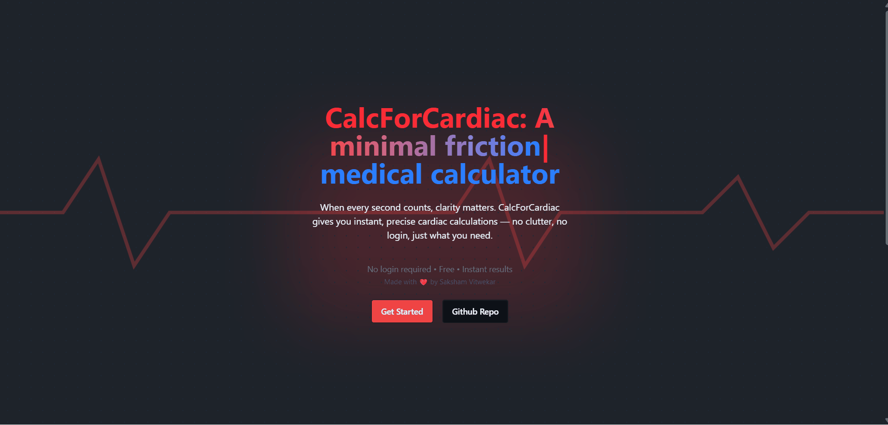

  

<a href="https://calcforcardiac.online/" ><h1 align="center">CalcForCardiac</h1></a>
<h3 align="center">A minimal friction and zero login clinical calculator made especially for cardiologists!</h3>

## ✨ Features

- ⚡ Zero login, instant access  
- 🫀 Multiple medical calculators all in one place
- 📱 Mobile-first responsive design  
- 💾 Local storage support (stores past results and bookmarks)  
- 🧠 Clinically relevant interpretations  

## Preview

    
    

## 📝 Section documentation
- [🫀 General Cardiology](#-general-cardiology)
- [🚨 Emergency](#-emergency)
- [🧬 Transplantation](#-transplantation)
- [🛠️ Utilities](#️-utilities)
## 🧮 Calculators
All of the calculators are accessible in the website. The below list contains the documentation written by me of the calculators that have been made
### Note:- Documents of some of the calculators may be missing from the repository, they will be made soon

## 🫀 General Cardiology

- [MAP](./docs/General%20Cardiology/MAP.md)  

## 🚨 Emergency

- [TIMI Score](docs/Emergency/TIMI.md)

## 🧬 Transplantation

- [IMPACT Score](docs/Transplantation/IMPACT.md)

## 🛠️ Utilities

- [Cockcroft gault Equation](docs/Utilities/cockcroft-gault-eq.md)
- [MELD Score](docs/Utilities/MELD.md)

## 🧠 Why CalcForCardiac?

Most existing clinical calculators:
- Require <b>login  </b>
- Are <b>cluttered and slow</b>

CalcForCardiac is built to:
- ⚡ Provide <b>instant access</b>
- 🧼 Keep UI <b>minimal and fast</b>
- 🩺 Deliver <b>clinically meaningful</b> outputs 